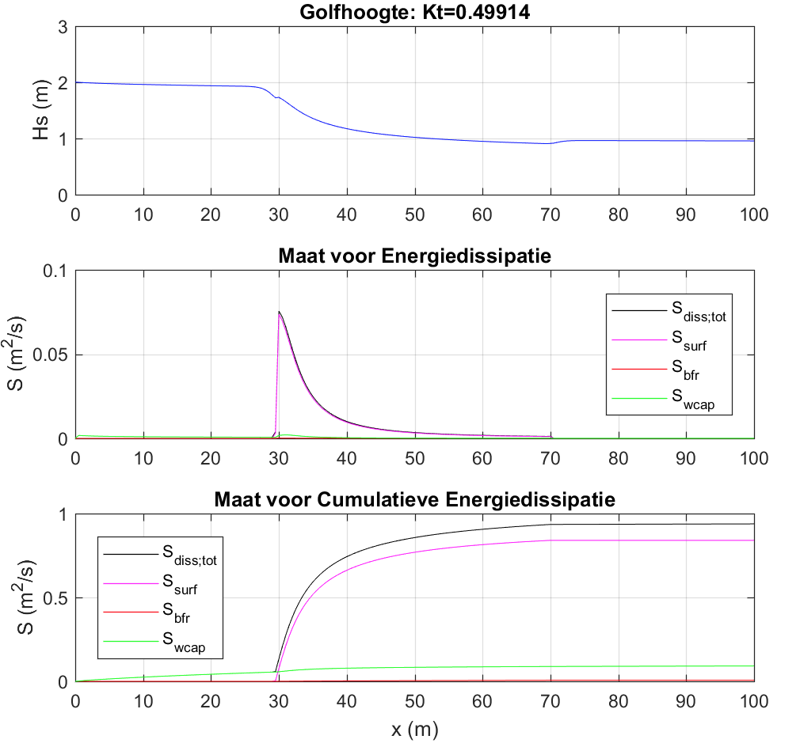

# BEP 

### Wave transmission over submerged dams

This repository contains the developed software related to a research of wave transmission over submerged dams. In order to get more insight into the physics of wave transmission over submerged dams, the transmission of waves have been modelled in SWAN ("Grid-model") and have been compared w.r.t. an empirical relationship (d'Angremond, 1996) of wave transmission ("Lijn-model").

The results of this study show that the dissipation term linked to surf-breaking is the main sink of the wave energy during the wave transmission over subemrged dams. Furthermore, if the restrictions on the emprical formula are not taken into account, the differences between both models are larger (outliers) w.r.t. the case in which the restrictions are taken into account. And hence the danger of extrapolation of the empirical formula has thus been demonstrated. 

It can also be concluded that the less wide dams are relatively well modeled, given that the errors of the "Grid-model" are relatively small w.r.t. the "Lijn-model". The wider dams show larger errors. This is in line with the expectations, since the simplification of the "Lijn-model" (simplification of the dam through an infinitely thin line in the middle of the dam) for the less wide dams is closer to reality than for the wider dams. There are some improvements possible with regards to the "Grid-model". Currently, there exisits an error margin between the values of the transmission coefficients of the "Grid-model" and the "Lijn-model", where the majority of the values of the "Grid-model" underestimated. It is therefore recommended to examine the influence of reflection on the "Grid-model". This could lead to an overal increase of the transmission coefficients of the "Grid-model" and hence a reduction of the error.

